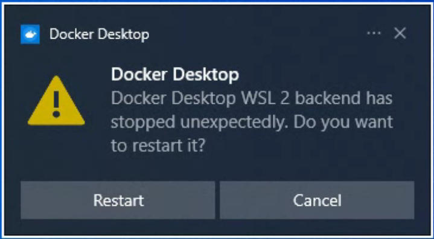
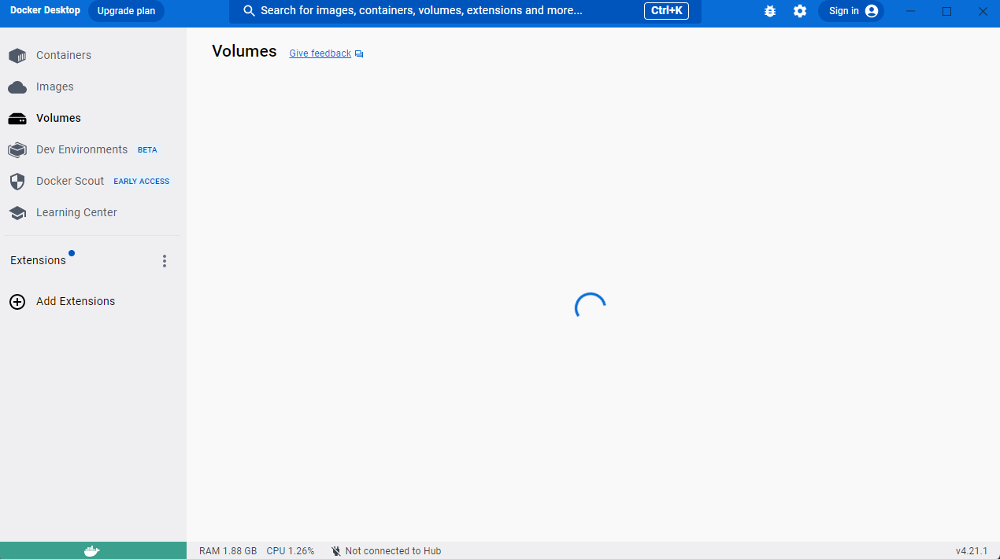
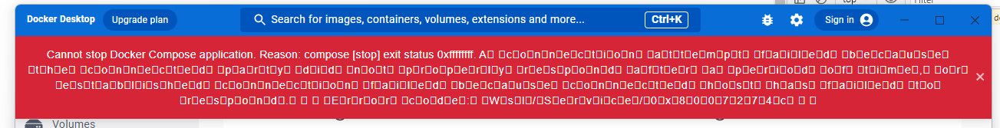
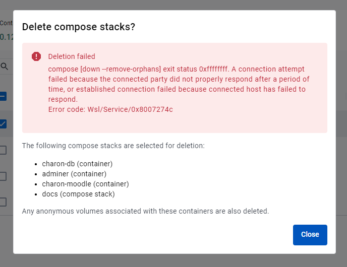
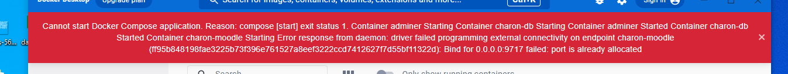

## Another day, another Docker error

Docker is a software development industry standard tool since 2020 for providing a isolated virtual Linux server environment. Docker is supposed to provide a way to prevent "it works on my machine" problems. This all seems good, but having worked on a project in Docker it seems the opposite is also true.

Docker has to be the most finnicky piece of software I have ever dealt. Sometimes the Docker Engine does just not start. Sometimes it crashes when starting up. Sometimes it is stuck in a loading state. While starting up seems to be the most problematic process, these errors persist for other lifecycle processes as well. All these problems seem to popup on a daily basis and the only way to solve it is to keep restarting the machine until it "just works" again. It might seem hard to believe the problem is this severe, at least it was for me.

I would like to dedicate the rest of this post into documenting all my Docker troubles. Most of the problems were related to starting up a Docker container. 

Sometimes the Docker Desktop did not start or was stuck loading.

Most of the times the container kept exiting without any error:

When that happened, the best option was usually to recreate the container, but often Docker refused to stop as well:

Even deletion was not quarantined to work:

Getting the container to run was also not a moment to celebrate just yet:

And sometimes the container refused to start due the container port reportedly being in use:

Makes me question if Docker is really what its hyped up to be or just a tradeoff for another problem. Is it just me or do these problems happen to anyone else as well?